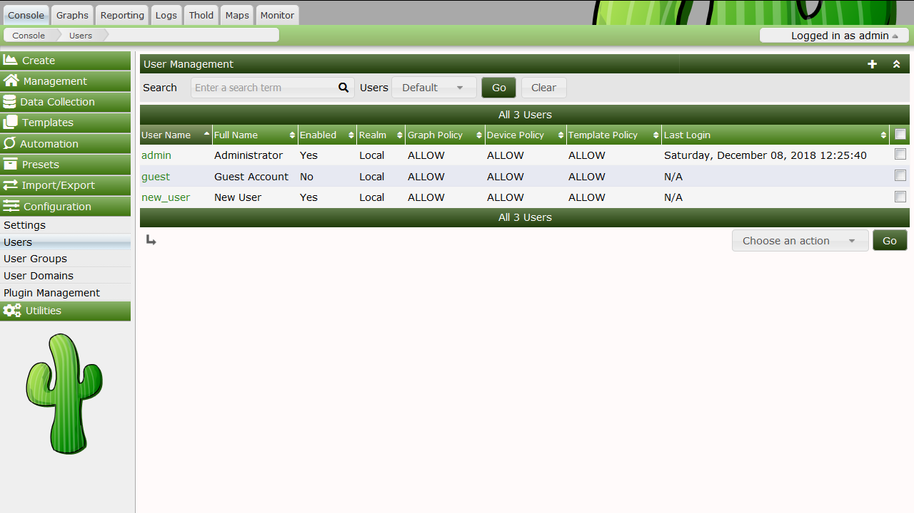
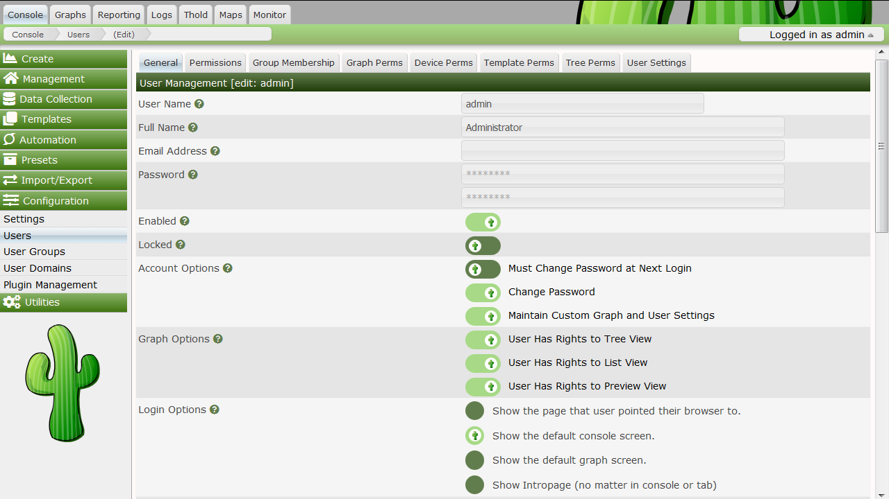
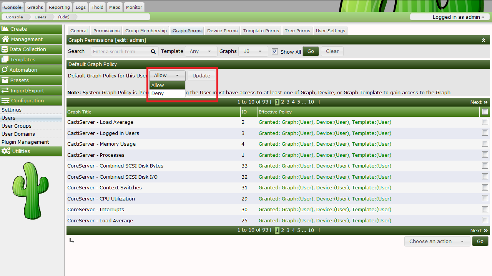
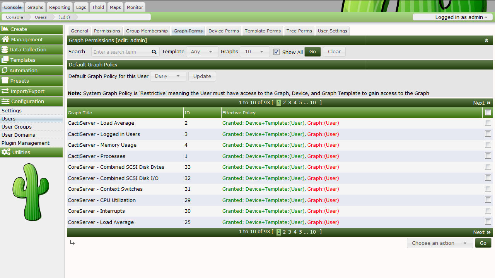
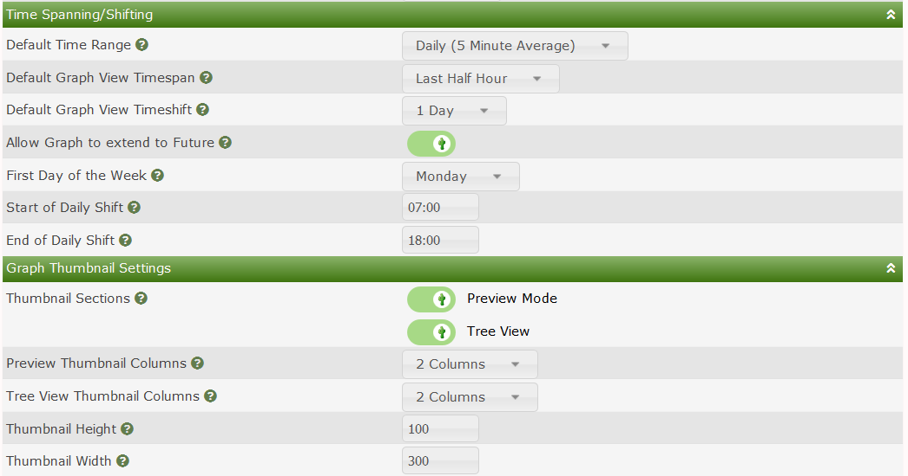
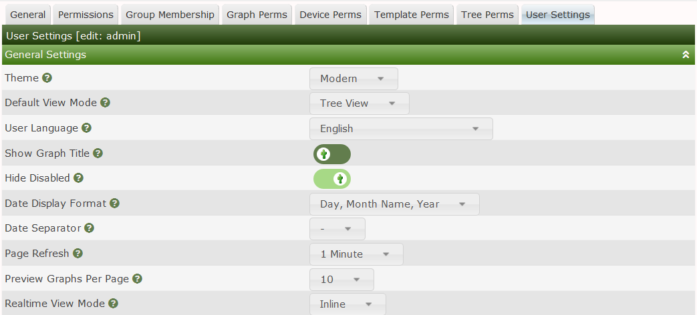
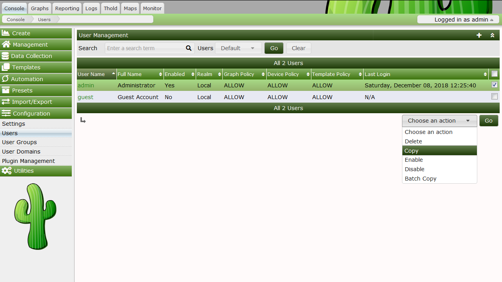
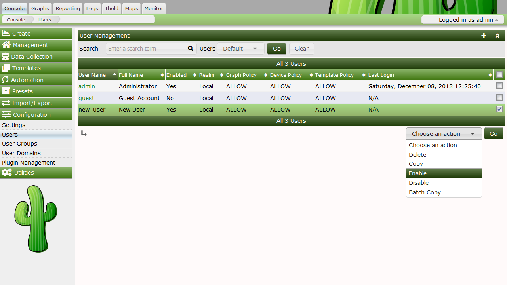
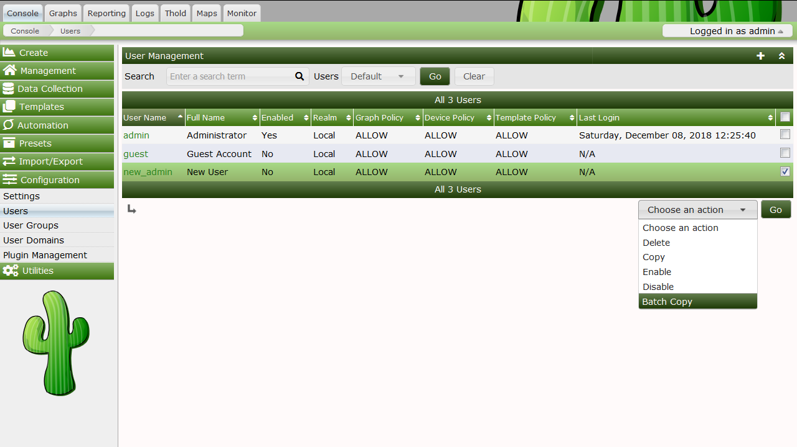
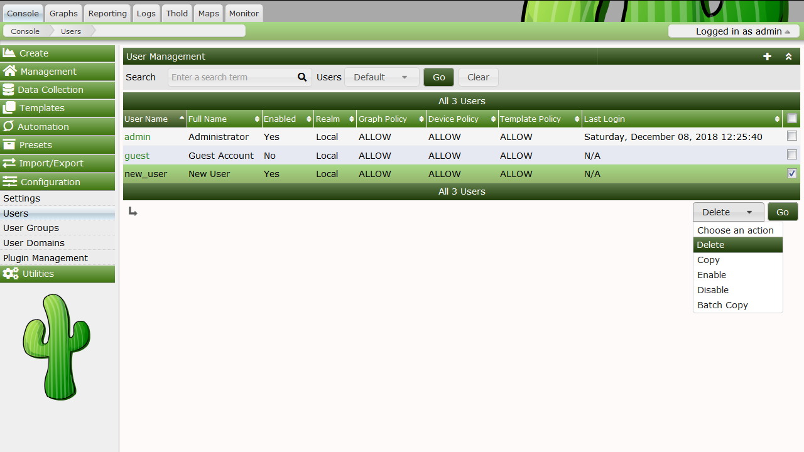

# User Management

In addition to giving you the tools to create sophisticated **Graphs**, Cacti enables you to manage **User** and **User Group** access to those **Graphs** as well as various other areas of Cacti. Each **User** has a variety of settings and permissions.  Some of these settings can be controlled by the individual **User** via editing their Profile, or controlled by the Cacti Administrator.  A **Users** Cacti permissions are only modifiable by authorized Cacti Adminnistrators.  Note, that for a users to see new settings, will have to log off and back in again to view.

Out of the box, there are two users that come with every Cacti installation. The "admin" user, is the main user that by default has access to see and change everything in Cacti. This is the user that you first login with in Cacti, and is probably a good idea to keep around unless you know otherwise. The second user is the "guest" user, which controls which areas/graphs are allowed for unauthenticated users. By default this user only has rights to view, but not change all graphs. This enables any unauthenticated user to visit 'graph_view.php' and view your graphs. This behavior can be changed by either changing the realm permissions for the "guest" user, or disabling the guest user altogether under Cacti Settings. By default in 0.8.7 and later, the "guest" user is not set in the setting, effectively disabling "guest" (Unauthenticated) access to Cacti.

## Editing an existing User

To edit an existing user, select the User Management item under the Utilities heading on the Cacti menu. Once at the user management screen, click username of the user you wish to edit. You will see a screen that looks similar to the image below.

At minimum, you must specify a User Name and a Password for each user. Each user field is described in more detail below. In addition to these fields, each user can have their own realm permissions", graph permissions, and graph settings. Each of these items are described in this section of the manual.

### User Management Options

- ***User Name*** - This field contains the actual login name for the user.  There are no character limits this field, but it would make sense to keep it to alphanumeric characters to maintain simplicity.

- ***Full Name*** - (Optional) You can use this field as a more descriptive identifier for the user. It is currently only used for display on the user management page.

- ***Password*** - Enter the password for the user twice, once in each text box. Keep in mind that passwords are case sensitive and the password will remain unchanged if the boxes are both left empty.

- ***Account Options*** - There are currently two account related options that can be set for each user.
  - ___User Must Change Password at Next Login___ - Force a password change immediately after the user logs in.
  - ___Allow this User to Keep Custom Graph Settings___ - Allows user to maintain their own custom graph viewing settings.

- ***Graph Options*** - Enables certain defined graph viewing options.
  - *User Has Rights to Tree View*
  - *User Has Rights to List View*
  - *User Has Rights to Preview View*

- ***Login Options*** - These options set what occurs after the user logs in.
  - ___Show the page that user pointed their browser to___ - Will point the user to whatever page they were heading to before being interrupted by the login page.
  - ___Show the default console screen___ - This option will always point the user to 'index.php' after a successful login.
  - ___Show the default graph screen___ This option will point the user to default graph view after login.

- ***Authentication Realm*** - This setting allows you to specify a user for use with `Local`, `Web Basic` or `LDAP` Authentication.
  **Note:** Template users must be Local.

## User Interface Permissions

Realm permissions control which areas of Cacti a user can access. You can edit a user's realm permissions by selecting User Management and choosing the user you want to edit the permissions for. The Realm Permissions box will be displayed in the lower part of the screen. Each "realm" is a grouping that represents common tasks in Cacti, making it easier to fine tune each user's
access.

If you want to create a user that can only view graphs, you should select the View Graphs realm and leave everything else unchecked. See the Graph Permissions section for more information about how to fine tune this even more on a per-graph basis. Conversely, if the user needs to access the console, they will need Console Access and any additional realms that you see fit.

## Graph Permissions

**Graph Permissions** control which graphs a user is allowed to view.  However, in general, these permissions do not apply to editing graphs. You can edit a **Users** **Graph Permissions** either by assigning that **User** to one to many **User Groups**, or by modifying their **Graph Permissions** directly.

Cacti supports two Graph Permission models.  There is the `Permissive` Graph permission which states that if a user has access either to the Graph, the Device or Graph Template, the user will have access to all the Graphs that match that class.  For example, in the `Permissive` model, if you have access to the **Device**, you have access to all it's **Graphs**.  If you have access to a **Graph Template**, you have access to every **Device Graph** that matches that **Graph Template**.

The second Graph Permission model is `Restrictive`.  In the `Restrictive` Graph permission model, you must have access either to the **Graph** directly, or both the **Device** and **Graph Template**.  Using this permission model requires the **Users** and **User Groups** have much more specific access if they want to gain access to various device Graphs.

We introduced these new permission models and administrative processes to simplify the Cacti permission system, and to increase it's usability.

In addition to the `Permissive` and `Restrictive` models, which can be set from **Console > Configuration > Settings > General**, a **User** or **User Group** is either `Allowed` or `Denied` all **Graphs*, **Devices** and **Graph Templates** through a setting called the **Default Policy** in each of the Permission Tabs.  The **Graph Permissions** tab includes an `Effective Policy`, which combines all the **Users** various **User Group* and **User** permissions to provide an effective permission.  If the **Graph** is ultimately permitted for the **User** to view, you will see for what reason from this Permission tab.

Note that even if a **User** is denied access to a **Device** or **Graph Template**, but has access to at least one **Graph** from that **Device** or **Graph Template**, they will see that **Device** or **Graph Template** name in areas of Cacti that display it.

## Default Permission Policies

## Device Permissions

**Device Permissions** allow you to `Grant` or `Revoke` access to specific **Devices**.  If you wish to `Grant` or `Revoke` access to a **Device**, you can select it, and then choose the specified action from the drop down, and press the `Go` button to make that permission change.  As mentioned above, revoking **Device** access does not necessarily block a **User** from seeing that **Device** from the User Interface.

## Template Permissions

**Template Permissions** allow you to `Grant` or `Revoke` access to specific **Graph Templates**.  If you wish to `Grant` or `Revoke` access to a **Graph Template**, you can select it, and then choose the specified action from the drop down, and press the `Go` button to make that permission change.  As mentioned above, revoking **Graph Template** access does not necessarily block a **User** from seeing that **Graph Template** from the User Interface.

## Tree Permissions

Cacti allows the Administrator to `Grant` and `Revoke` **Tree** permissions from this tab.  The Cacti **Tree** permissions are a single level security object.  However, when you browse a **Tree** to it's various branches, a user will only be allowed access to the Graphs and Devices that they have access to.  Managing permissions to **Trees** is identical to **Graphs**, **Devices** and **Graph Templates** otherwise.  Additionally, Cacti has will hide branches from a **User** when they have no access to any **Devices** or **Graphs** within it.

## User Settings

Cacti optionally allows **Users** to control certain **User Settings** such as their `Email Address` and `Full Name`.  However, the Cacti Adminnistrator also has the ability to view a **Users** settings and modify them for the **User** from the **User Settings** tab.  This feature allows the Cacti Administrator to better support their **Users**.  However, you can disable a **Users** ability to modify defaults from the `General` **User Management** tab.  This is important for the `guest` account for example.

## Caching of Permissions

In order to increase Cacti User Interface performance, when a **User** first checks for their permissions after login to either **Devices** or **Graph Templates** that permission is cached for their entire login session.  If you chance a **Users** **Device** or **Graph Template** permissions, they will not see those permission changes until their next login.

## Creating a New User

To create a new user, select the User Management item under the Utilities heading on the Cacti menu. Once at the user management screen, click the plus (+) glyph.

At minimum, you must specify a `User Name`, `Password` and `Login Realm` for each user. Each **User** field is self documented either below the field, or in the help bubble to the right of it. In addition to the fields on the `General` tab, settings can be controlled from the various sub-tabs when editing a user.  Those sub tabs include:

### General

From this sub-tab, you can modify general **User** attributes including Full Name, Email Address, Lockout status, Account Options, Graph Options, etc.

### Permissions

From this sub-tab, you control what areas of Cacti a **User** has access to.  Cacti has broken those access areas into various `Roles` to make the setting of permissions easier to understand.  Note that **Plugin** permissions are still grouped by Plugin in the current version of Cacti.  This will change over the next few releases to be more in line with the various Cacti Roles.

### Group Membership

From this sub-tab, you can assign or remove users from various **User Groups**.

### Graph Perms

From this sub-tab, you can view a users `Effective` Graph permisions and also `Grant` or `Revoke` access to **Graphs** for an individual **User**.

### Device Perms

From this sub-tab, you can view and edit a users **Device** permissions.  Note that removing a users permission to a **Device** can be overwridden if they have access to either a **Graph** or, depending on the permission model you have chosen, a **Devices** **Graph Template**.

### Template Perms

From this sub-tab, you can `Grant` or `Revoke` a **Users** access to various Cacti **Graph Templates**.

### Tree Perms

From this sub-tab, you can `Grant` or `Revoke` a **Users** access to the various Cacti **Trees**.

### User Settings

From this sub-tab, you can modify a **Users** settings to assist the **User** with their use of Cacti, or to set defaults for that **User**.

## Copying a user

To copy a **User** to a new one, go to **Console > Configuration > Users**. Once at the **Users** interface, highlight the **User** you would like to copy from and select `Copy` from the `Choose an action` drop down selection box, click `Go` to continue. If you select multiple users, only the first selected **User** will be used as the source **User**.

Specify the New Username, New Full Name and New Realm of the new user. Click `Continue` to copy the selected template user to the the designated new user. An error will be returned if you attempt to copy over an existing user. If you would like to copy over an existing user, use Batch Copy.

## Enable/Disable Users

To enable or disable a set of or a single user, select the User Management item under the Utilities heading on the Cacti menu. Once at the **Users** interface, highlight the **User** you would like to `Enable` or `Disable` and select either `Enable` or `Disable` from the `Choose an action` drop down selection box, click `Go` to continue.

Confirm that you want to disable or enable the listed users. Click `Continue` to perform the action. Disabling your own account is not permitted.

## Batch Copy Users

Batch Copy is a helpful utility that helps Cacti Administrators maintain users.  Because Cacti does not yet support groups, it is important that there is some way to mass update users. This what Batch Copy does for you.

To Batch Copy a set of or a single user, select the **Users** interface under **Console > Configuration**. Once at the **Users** interface, highlight the **Users** you would like to batch copy information to and select `Batch Copy` from the `Choose and action` drop down selection box, click `Go` to continue.

Select the `Template User` and confirm that you want to `Batch Copy` the listed **Users**. Click `Continue` to perform the action.

It is important to note that when using `Batch Copy` the original **Users** `Full Name`, `Password`, `Login Realm` and `Enable` status will be retained, all other fields will be overwritten with values from the selected `Template User`.

## Delete Users

To delete a set of or a single **User**, highlight the **Users** from **Console > Configuration > Users** interface, then select `Delete` from the `Choose an action` drop down selection box and press `Go` to continue.

Confirm that you want to delete the listed users. Click `Continue` to perform the action. Deleting your own account is not permitted.

## Guest (Anonymous) Access

By default, Guest or Anonymous access is disabled in Cacti.  Enabling "Guest" access is easy. But, you must understand that you should only allow the designated "Guest" user access to what you authorized. It is not suggested that you give the designated "Guest" user more than just access to graphs. To enable guest access, first, need a designated "Guest" user. Cacti by default comes with one already created that has access to only graphs. It is important to note that the default guest user has access to all graphs on the system. Once you have created the "Guest" user, you need to tell Cacti what the "Guest" user is. This is done by updating the Authentication Settings and selecting the "Guest" user you have designated. The "Guest" user must be enabled and be set as the guest user for anonymous access to work.

---
Copyright (c) 2004-2019 The Cacti Group
